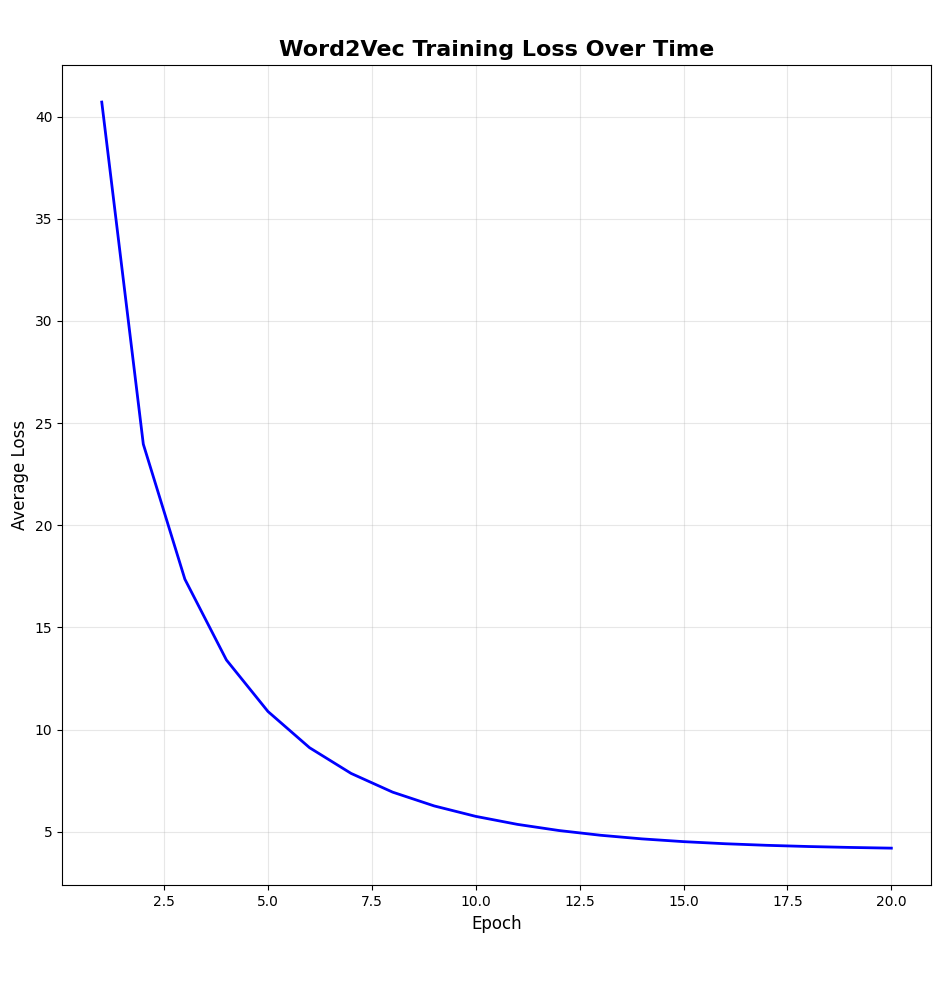

# Word2Vec Implementation from Scratch

A complete implementation of the Word2Vec Skip-gram model built from scratch using NumPy. This project demonstrates the fundamental concepts of word embeddings and neural language models without relying on deep learning frameworks.

## 🎯 Features

- **Skip-gram Word2Vec Model**: Implemented with vanilla NumPy
- **Custom Neural Network**: Two-layer neural network with softmax output
- **Flexible Training**: Configurable embedding dimensions, learning rate, and epochs
- **Word Similarity**: Find semantically similar words using cosine similarity
- **Training Visualization**: Plot loss curves to monitor training progress
- **Text Processing**: Built-in dataset handling and vocabulary creation

## 📊 Sample Results

```
Top 5 most similar words to 'king':
----------------------------------------
chief: 0.3631
anarchiste: 0.3088
regarded: 0.2825
general: 0.2742
being: 0.2662
```

### Training Loss Visualization



The model shows steady convergence during training, with loss decreasing over epochs.

## 🚀 Quick Start

### Installation

1. Clone the repository:
```bash
git clone <repository-url>
cd Word2Vec-Scratch
```

2. Install dependencies:
```bash
pip install -r requirements.txt
```

### Running the Demo

```bash
python main.py
```

This will:
- Load the text8 dataset (first 1000 words)
- Train a Word2Vec model with 300-dimensional embeddings
- Find the top 5 most similar words to a random word
- Display training loss visualization

## 🏗️ Model Architecture

### Skip-gram Model

The implementation uses the Skip-gram architecture, which predicts context words given a center word:

```
Input Layer (One-hot encoded word)
       ↓
Hidden Layer (Word Embedding)
       ↓
Output Layer (Softmax probabilities)
```

### Network Components

- **Input Layer**: One-hot encoded vectors of vocabulary size
- **Hidden Layer**: Dense layer producing word embeddings (default: 300 dimensions)
- **Output Layer**: Softmax layer predicting context words
- **Loss Function**: Categorical cross-entropy
- **Optimizer**: Stochastic Gradient Descent (SGD)


## 📁 Project Structure

```
Word2Vec-Scratch/
├── dataset/
│   ├── __init__.py
│   ├── dataset.py          # Dataset loading and preprocessing
│   └── text8               # Training corpus
├── network/
│   ├── __init__.py
│   ├── word2vec.py         # Main Word2Vec implementation
│   ├── activations.py      # Activation functions (softmax)
│   └── losses.py           # Loss functions (categorical crossentropy)
├── figures/
│   └── train.png           # Training loss visualization
├── main.py                 # Demo script
├── requirements.txt        # Dependencies
└── README.md              # This file
```

## 📖 Implementation Details

### Dataset Class (`dataset/dataset.py`)

- **Text Processing**: Loads and tokenizes text data
- **Vocabulary Creation**: Builds word-to-index mapping
- **One-hot Encoding**: Converts words to vector representations
- **Training Data Generation**: Creates (center_word, context_word) pairs using sliding window

### Word2Vec Class (`network/word2vec.py`)

- **Weight Initialization**: Random initialization of embedding matrices
- **Forward Propagation**: Computes word embeddings and predictions
- **Backpropagation**: Updates weights using gradient descent
- **Embedding Extraction**: Retrieves learned word representations
- **Similarity Calculation**: Computes cosine similarity between embeddings

### Key Parameters

| Parameter | Description | Default Value |
|-----------|-------------|---------------|
| `embedding_size` | Dimensionality of word vectors | 300 |
| `vocabulary_size` | Number of unique words | Auto-calculated |
| `learning_rate` | SGD learning rate | 0.1 |
| `window_size` | Context window for training data | 10 |
| `epochs` | Number of training iterations | 20 |

## 🔧 Customization

### Training on Custom Data

Replace the text8 dataset with your own text file:

```python
dataset = Dataset("path/to/your/text.txt", num_words=5000)
```

### Hyperparameter Tuning

Experiment with different configurations:

```python
# Larger embeddings for richer representations
model = Word2Vec(embedding_size=500, vocabulary_size=vocab_size, learning_rate=0.05)

# Larger context window for more training pairs
x, y = dataset.generate_training_data(window_size=15)

# Extended training
loss_history = model.train(x, y, epochs=50)
```

## 📈 Training Process

The model uses the Skip-gram objective:
1. For each word in the corpus, create training pairs with surrounding context words
2. Train the neural network to predict context words given the center word
3. The hidden layer weights become the word embeddings

### Loss Monitoring

The training process outputs epoch-by-epoch loss:
```
Epoch 1/20: Loss -> 2.876543
Epoch 2/20: Loss -> 2.654321
...
```

## 🎯 Applications

This implementation can be used for:
- **Word Similarity**: Find semantically related words
- **Text Analysis**: Analyze word relationships in corpus
- **Feature Engineering**: Generate word features for downstream tasks
- **Educational Purposes**: Understand Word2Vec mechanics
- **Research**: Experiment with modifications to the base algorithm

## ⚠️ Limitations

- **Computational Efficiency**: Pure NumPy implementation is slower than optimized frameworks
- **Memory Usage**: One-hot encoding can be memory-intensive for large vocabularies
- **Scalability**: Not optimized for very large datasets
- **Advanced Features**: No hierarchical softmax or negative sampling optimizations

## 🛠️ Dependencies

- **NumPy** (≥1.21.0): Numerical computations and matrix operations
- **Matplotlib** (≥3.5.0): Training loss visualization and plotting

## 🤝 Contributing

Feel free to contribute improvements:
- Performance optimizations
- Additional features (negative sampling, hierarchical softmax)
- Better visualization tools
- Extended documentation

## 📚 References

- [Efficient Estimation of Word Representations in Vector Space](https://arxiv.org/abs/1301.3781) - Original Word2Vec paper
- [Distributed Representations of Words and Phrases and their Compositionality](https://arxiv.org/abs/1310.4546) - Skip-gram with Negative Sampling

## 📄 License

This project is available under the terms specified in the LICENSE file.